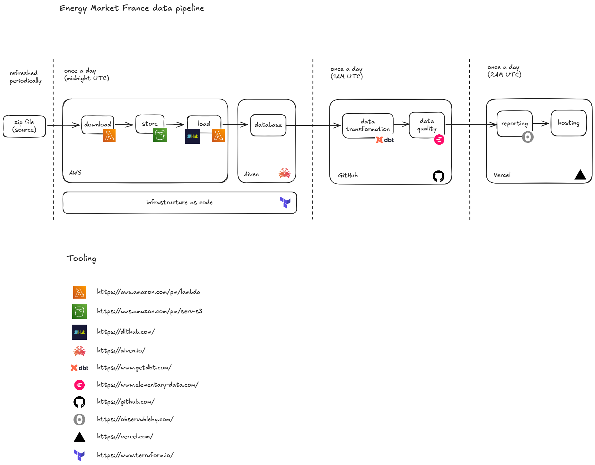

# Data Sources

Feeds from [ecologie.data.gouv.fr](https://ecologie.data.gouv.fr/datasets/55f0463d88ee3849f5a46ec1).

# Architecture

# Schedules

- Ingestion (AWS Lambda) - 0AM UTC
- Data Modeling (Dbt) - 1AM UTC 
- Publish reports (ObservableHQ/Vercel) - 2AM UTC 

# TODO
- Describe new data source (deprecated EPC/DPE) and add to the analysis pages
- Refactor data models to:
  * have `fact` models for hour and day aggregated data
- Find better formatting solution (12k MW -> 12B W?)
- Data Quality: add data freshness indicator
- Add charts to represent usage and working/ooo hours
- Add headlines (e.g. total/avg energy used over the period)
- Publish [Elementary](https://docs.elementary-data.com/oss/guides/share-observability-report/host-on-s3) report
- Ingest meteorological data (wind speed, solar radiation, rainfall) to correlate with renewables
- Add comparison with previous period
- refactor FileAttachment time period switcher into a helper
- CICD for Terraform and (Node) Lambda
- CICD linting
- improve charts:
  - clickable legend filtering
  - single tooltip regardles of series count
- Terraform Vercel(?)
